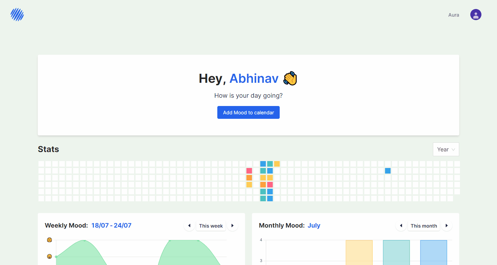

<p align="center">
  <a href="https://aura-ar.vercel.app/">
    
  </a>
</p>

<h4 align="center">Your mood changes throughout the days. <br /><i>But what if you could see it?</i></h4>

<p align="center">
<a href="https://github.com/AbhinavRajesh/Aura/blob/main/LICENSE" target="blank">

</a>
<a href="https://github.com/abhinavrajesh/aura/stargazers" target="blank">

</a>
<a href="https://github.com/abhinavrajesh/aura/issues" target="blank">

</a>
<a href="https://github.com/abhinavrajesh/aura/fork" target="blank">

</a>
<a href="https://github.com/abhinavrajesh/aura/pulls" target="blank">

</a>
<a href="https://twitter.com/intent/tweet?text=Checkout%20aura-ar.vercel.app%20by%20%40AbhinavRajesh%0AAn%20easy%20to%20use%20mood%20tracking%20app%20that%20takes%20your%20daily%20life%20mood%20into%20account.%20It%20allows%20you%20to%20understand%20yourself%20better.%20The%20app%20has%20various%20feature%20such%20as%20graphs%2C%20statistics%2C%20and%20relaxing%20sound%20and%20much%20more!%0A%23DEVCommunity"></a>

</p>
<p align="center">
<a
   href="https://www.producthunt.com/posts/aura-b260f046-6bf7-439f-8cd7-8521db48ae46?utm_source=badge-featured&utm_medium=badge&utm_souce=badge-aura-b260f046-6bf7-439f-8cd7-8521db48ae46"
   target="_blank"
   rel="noopener noreferrer"
>
   
</a>
</p>
<h1 align="center">Introducing Aura: See your mood in a whole new light.</h1>

Introducing [Aura](https://aura-ar.vercel.app), an easy to use mood tracking app that takes your daily life's mood into account. It allows you to understand yourself better and helps you maintain an even mood throughout the day. The app has various features such as **graphs, statistics, insights, and relaxing sounds to improve you mood.** And the best part? It's free!

<a href="https://blog.abhinavrajesh.com/introducing-aura-see-your-mood-in-a-whole-new-light" target="_blank" rel="noopener noreferrer">More on it at my blog</a>

<b>Here is a quick sneakpeek of the app!</b>

<p align="center"></p>

<p align="center">
    <a href="https://aura-ar.vercel.app/" target="blank">Live App</a>
    ·
    <a href="https://github.com/abhinavrajesh/aura/issues/new/choose">Report Bug</a>
    ·
    <a href="https://github.com/abhinavrajesh/aura/issues/new/choose">Request Feature</a>
</p>

## Steps to Setup

1. Clone the repository

   ```bash
   git clone https://github.com/AbhinavRajesh/Aura.git
   ```

2. Change the working directory

   ```bash
   cd Aura
   ```

3. Install dependencies

   ```bash
   yarn
   ```

4. Run the app

   ```bash
   yarn start
   ```

Open [localhost:3000](http://localhost:3000/) to see the app. 🎉

## Contributing

This is an open source project so you're always welcome to contribute ideas, report issues or send in pull requests!

This project is licensed under the [MIT License](LICENSE)

## What's in the pipeline?

- Daily push notification/email reminders for users to remind them to enter their mood.
- Suggest methods to improve users mood when they feel low.
- Weekly emails with reports and ways to improve their mood if their average mood score is low for the week.
- A tab to enter and store users best memories so they could relive that moment and be happy.
- And much more! If you have any feature in mind which might make this app better then feel free to drop an issue and I would be happy to go through them!

## Deploy

<a href="https://vercel.com/new/project?template=https://github.com/abhinavrajesh/aura">

</a>
<a href="https://app.netlify.com/start/deploy?repository=https://github.com/abhinavrajesh/aura">

</a>
</a>

## Lets connect

Github: [@AbhinavRajesh](https://github.com/AbhinavRajesh) <br />
Twitter: [@\_AbhinavRajesh\_](https://twitter.com/_AbhinavRajesh_) <br />
LinkedIn: [@abhinavrajesh](https://linkedin.com/in/abhinavrajesh) <br />
Hashnode: [@AbhinavRajesh](https://hashnode.com/@AbhinavRajesh) <br />

## Support

If you're enjoying my app, maybe consider supporting me with a coffee ☕️ or Leaving a ⭐ to the [repo](https://github.com/AbhinavRajesh/Aura) would make my day and motivate me to keep going :D

<a href="https://www.buymeacoffee.com/abhinavrajesh" target="_blank"></a>
